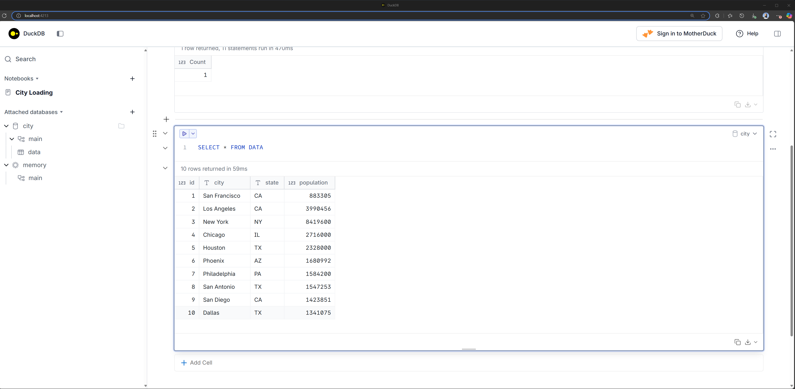

# data-playground

Messing around with Data Vendor tooling.

## How to use, on a Linux machine

1. Get a fresh new WSL machine up:

   ```powershell
   # Delete old WSL
   wsl --unregister Ubuntu-24.04

   # Create new WSL
   wsl --install -d Ubuntu-24.04
   ```

1. Clone the repo, and open VSCode in it:

   ```bash
   cd ~/

   git config --global user.name "Raki Rahman"
   git config --global user.email "mdrakiburrahman@gmail.com"
   git clone https://github.com/mdrakiburrahman/data-playground.git

   cd data-playground/
   code .
   ```

1. Reset your docker WSL integration since this is a new VM:

   > `Docker Desktop: Settings > Resources > WSL Integration > Turn off/on Ubuntu-24.04`

1. Run the bootstrapper script, that installs all tools idempotently:

   ```bash
   GIT_ROOT=$(git rev-parse --show-toplevel)
   chmod +x ${GIT_ROOT}/contrib/bootstrap-dev-env.sh && ${GIT_ROOT}/contrib/bootstrap-dev-env.sh
   ```

## Start Duck DB UI

```bash
duckdb -ui
```

Run:

```sql
CREATE OR REPLACE TABLE data (id int, city varchar(50), state char(2), population int);

INSERT INTO data VALUES (1, 'San Francisco', 'CA', 883305);
INSERT INTO data VALUES (2, 'Los Angeles', 'CA', 3990456);
INSERT INTO data VALUES (3, 'New York', 'NY', 8419600);
INSERT INTO data VALUES (4, 'Chicago', 'IL', 2716000);
INSERT INTO data VALUES (5, 'Houston', 'TX', 2328000);
INSERT INTO data VALUES (6, 'Phoenix', 'AZ', 1680992);
INSERT INTO data VALUES (7, 'Philadelphia', 'PA', 1584200);
INSERT INTO data VALUES (8, 'San Antonio', 'TX', 1547253);
INSERT INTO data VALUES (9, 'San Diego', 'CA', 1423851);
INSERT INTO data VALUES (10, 'Dallas', 'TX', 1341075);

SELECT * FROM DATA
```

